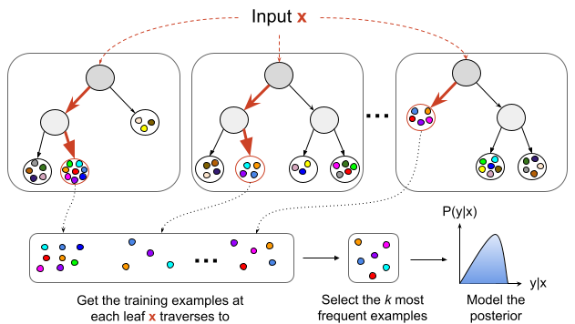

IBUG: Instance-Based Uncertainty Estimation for Gradient-Boosted Regression Trees
---
[](https://pypi.org/project/ibug/)
[](https://pypi.org/project/ibug/)
[](https://github.com/jjbrophy47/ibug/blob/master/LICENSE)
[](https://github.com/jjbrophy47/ibug/actions/workflows/wheels.yml)

**IBUG** is a simple wrapper that extends *any* gradient-boosted regression trees (GBRT) model into a probabilistic estimator, and is compatible with all major GBRT frameworks including LightGBM, XGBoost, CatBoost, and SKLearn.

<p align="center">
	
</p>

Install
---

```shell
pip install ibug
```

Quickstart
---

```python
from ibug import IBUGWrapper
from lightgbm import LGBMRegressor
from sklearn.datasets import load_diabetes
from sklearn.model_selection import train_test_split

# load diabetes dataset
data = load_diabetes()
X, y = data['data'], data['target']

# create train/val/test split
X_train, X_test, y_train, y_test = train_test_split(X, y, test_size=0.1, random_state=1)
X_train, X_val, y_train, y_val = train_test_split(X_train, y_train, test_size=0.1, random_state=1)

# train GBRT model
model = LGBMRegressor().fit(X_train, y_train)

# extend GBRT model into a probabilistic estimator
prob_model = IBUGWrapper().fit(model, X_train, y_train, X_val=X_val, y_val=y_val)

# predict mean and variance for unseen instances
location, scale = prob_model.pred_dist(X_test)

# return k highest-affinity neighbors for more flexible posterior modeling
location, scale, train_idxs, train_vals = prob_model.pred_dist(X_test, return_kneighbors=True)
```

License
---
[Apache License 2.0](https://github.com/jjbrophy47/ibug/blob/master/LICENSE).

<!--Reference
---
Brophy and Lowd. [Instance-Based Uncertainty Estimation for Gradient-Boosted Regression Trees](). arXiv 2022.

```
```-->
